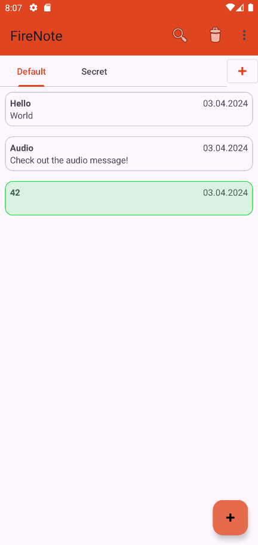

# FireNote

FireNote is a simple note-taking Android app. It is a work-in-progress project used mainly for learning purposes,
but also because I´m tired of ad-infested bloatware in the PlayStore.

## Features

* Intuitive UI based on Material 3 Design
* Persists notes on local filesystem
* Recording and playback of audio notes
* Set note notifications for specific dates and times
* Quickly delete multiple notes per long-press
* Reordering of notes per Drag & Drop
* Search notes based on title or content

## Planned

* Organize notes into user defined folders (work-in-progress)
* Mark specific notes as favorites
* Sort notes based on time or title
* Greater control over notifications (e.g. repeated alarms, custom ringtones)

## Screenshots

| Overview Screen                                            | Details Screen                                           |
|------------------------------------------------------------|----------------------------------------------------------|
|  |  |
